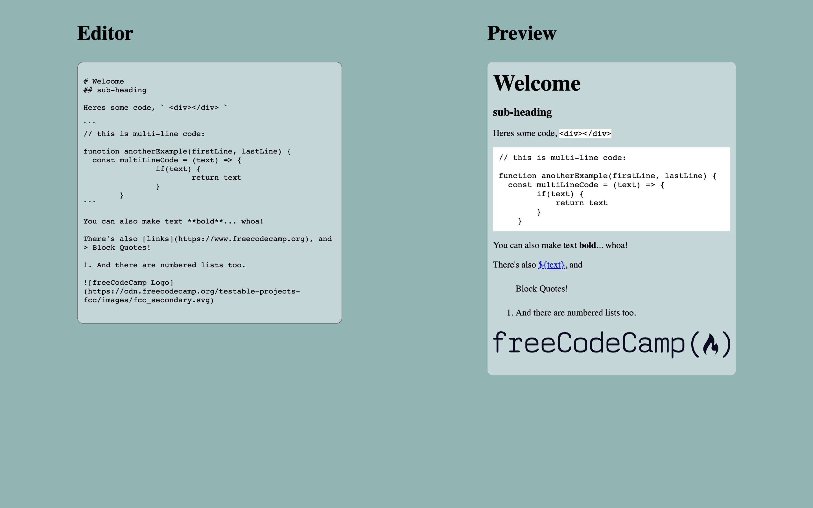

# MarkDown Previewer

An App that display/preview markdown language code.

## Screenshots

## Demo

[Link](https://codepen.io/thepageguy/pen/yLGzpPW)

## Author

- [@thepageguy](https://www.github.com/thepageguy)

## Acknowledgement

- [FreeCodeCamp](https://www.freecodecamp.org/)

## Tech Stack

**Languages:** HTML5, CSS3 and React.js

## Features

- Display/Preview MarkDown Language Code

## Lessons Learned

- MarkDown API
- React Variables Modifications

## Feedback

If you have any feedback, please reach out at thepageguy@mailfence.com.